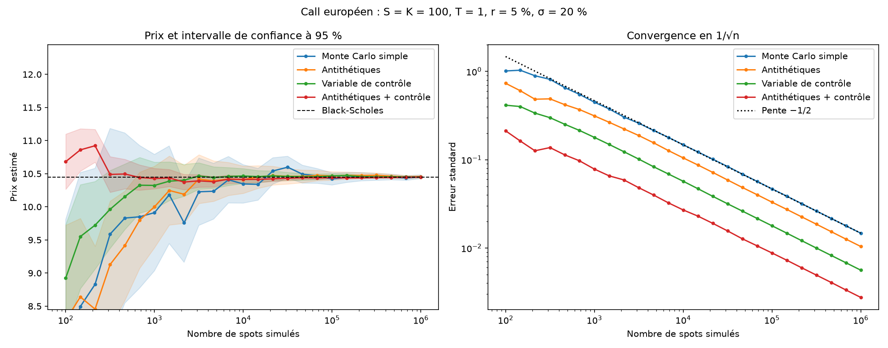
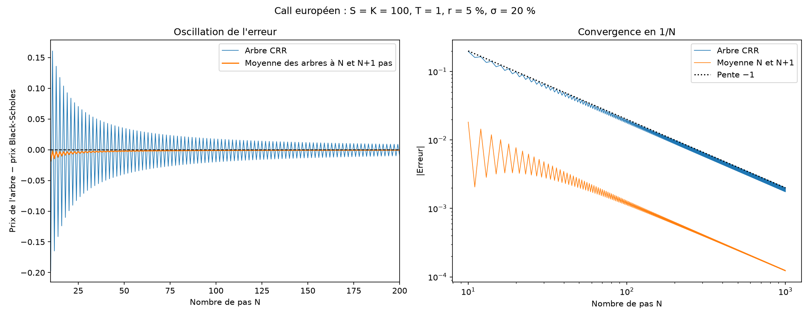
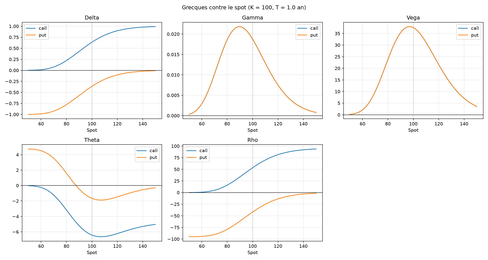
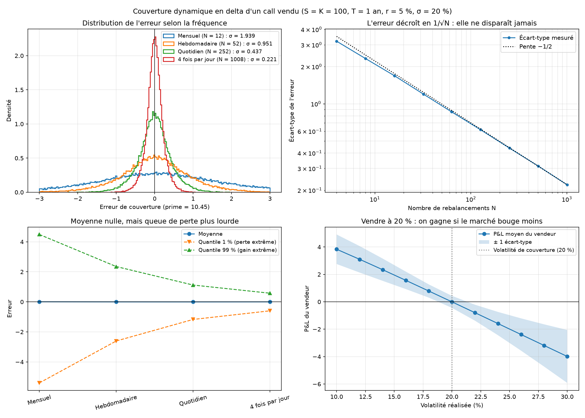
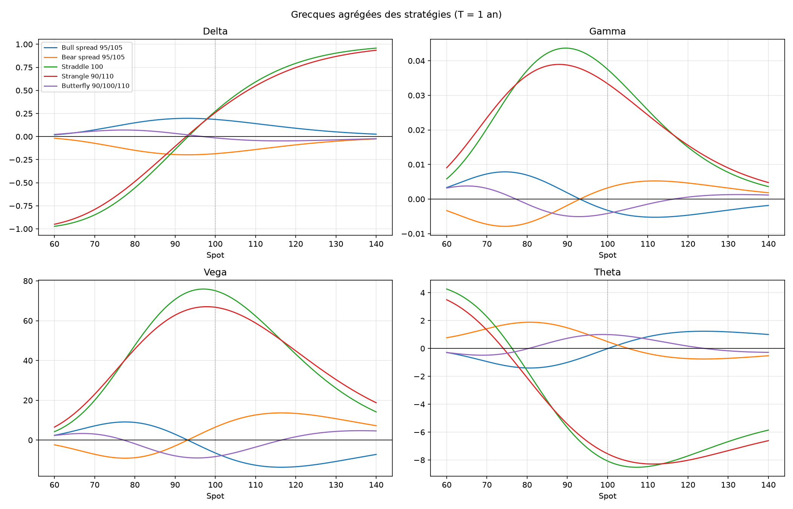
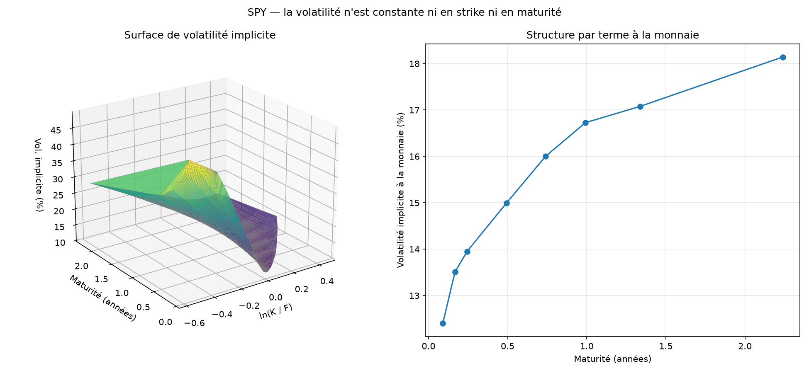
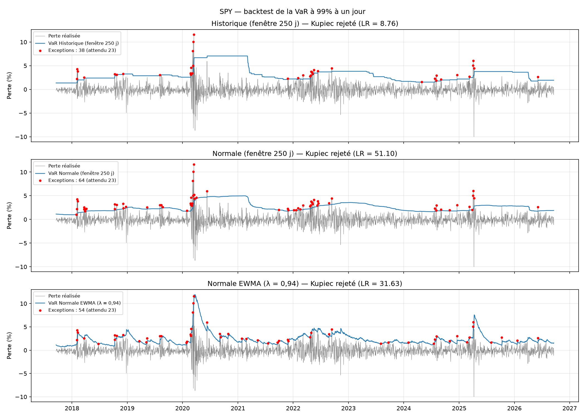

# Moteur de valorisation d'options


Moteur de valorisation et de gestion du risque d'options en Python, construit autour d'un
principe : aucune méthode n'est considérée comme juste tant qu'elle n'est pas vérifiée par une
méthode structurellement indépendante.

**[Lire le white paper (7 pages)](docs/White_paper_moteur_valorisation.pdf)**
**[Essayer l'application en ligne](https://moteur-valorisation.streamlit.app/)**

## Résultats clés

- **Trois moteurs validés croisément** : Black-Scholes analytique, Monte Carlo, arbre binomial CRR.
  Le call de référence (S = K = 100, T = 1, r = 5 %, σ = 20 %) vaut 10,4506 par les trois voies.
- **Réduction de variance** : gain de 28 en combinant variables antithétiques et variable de
  contrôle, supérieur au produit des gains séparés (2,0 × 6,8).
- **Options américaines** : prime d'exercice anticipé du put de 0,518 (9 % de sa valeur).
- **Couverture en delta** : avec un rebalancement quotidien, l'erreur de réplication a un
  écart-type de 4,2 % de la prime ; elle décroît en 1/√N et ne disparaît jamais.
- **Surface de volatilité sur SPY** : 934 points sur 8 maturités, forward et spot implicites
  estimés par parité call-put (résidus de 3 points de base), une seule violation d'arbitrage.
- **Backtest de VaR sur 9 ans de SPY** : trois modèles rejetés par Kupiec (38, 54 et 64
  exceptions contre 22,6 attendues), mise en évidence de l'effet fantôme et des grappes de crise.
- **1066 tests automatiques**, exécutables hors ligne.

## Architecture

Le projet sépare trois notions qui changent pour des raisons différentes :

- **`MarketData`** : l'état du marché (spot, taux, dividende, volatilité).
- **`Instrument`** : le contrat et son payoff (`EuropeanOption`, `AmericanOption`, `Underlying`,
  `Portfolio`).
- **`PricingEngine`** : la méthode de calcul (`BlackScholesEngine`, `MonteCarloEngine`,
  `BinomialTreeEngine`).

Un même instrument est valorisé par plusieurs moteurs, ce qui rend la validation croisée
possible. `Portfolio` est lui-même un instrument (patron Composite), et les grecques par
différences finies fonctionnent avec n'importe quel moteur.

```
pricer/
├── market_data.py         état du marché
├── instruments.py         options européennes, américaines, sous-jacent
├── portfolio.py           agrégation pondérée, grecques agrégées, couverture en delta
├── strategies.py          spreads, straddle, strangle, butterfly
├── greeks.py              conteneur des cinq grecques
├── finite_difference.py   grecques par différences finies, tous moteurs
├── hedging.py             simulation de couverture dynamique en delta
├── implied_vol.py         inversion de Black-Scholes (Newton + dichotomie)
├── market_data_feed.py    récupération et nettoyage des chaînes d'options
├── vol_surface.py         surface de volatilité et tests d'arbitrage
├── risk.py                VaR et Expected Shortfall (trois méthodes)
├── backtest.py            backtesting, test de Kupiec, zones de Bâle
├── plots.py               bibliothèque de graphes
└── engines/
    ├── base.py            interface commune
    ├── analytic.py        Black-Scholes et grecques analytiques
    ├── monte_carlo.py     Monte Carlo avec réduction de variance
    └── binomial.py        arbre CRR, européennes et américaines
```

## Installation

```bash
git clone https://github.com/TTB10/moteur-valorisation.git
cd moteur-valorisation
python -m venv .venv
pip install -r requirements.txt
```

## Utilisation

```python
from pricer.market_data import MarketData
from pricer.instruments import EuropeanOption, AmericanOption
from pricer.engines.analytic import BlackScholesEngine
from pricer.engines.binomial import BinomialTreeEngine

marche = MarketData(spot=100, rate=0.05, dividend=0.0, vol=0.2)

BlackScholesEngine().price(EuropeanOption(100, 1.0, "call"), marche)    # 10.4506
BlackScholesEngine().greeks(EuropeanOption(100, 1.0, "call"), marche)   # delta 0.6368...
BinomialTreeEngine(1000).price(AmericanOption(100, 1.0, "put"), marche) # 6.0896
```

## Scripts

Chaque script produit une figure dans `figures/`.

| Commande | Résultat |
|---|---|
| `python -m scripts.comparaison_methodes` | Tableau comparatif des trois moteurs |
| `python -m scripts.reduction_variance` | Gains de variance de Monte Carlo |
| `python -m scripts.convergence_monte_carlo` | Convergence en 1/√n |
| `python -m scripts.convergence_arbre` | Convergence en 1/N et oscillation de l'arbre |
| `python -m scripts.bibliotheque_graphes` | Payoffs, prix et grecques |
| `python -m scripts.couverture_delta` | Distribution de l'erreur de couverture |
| `python -m scripts.strategies_graphes` | Profils et grecques des stratégies |
| `python -m scripts.surface_volatilite` | Surface de volatilité implicite (réseau requis) |
| `python -m scripts.backtest_var` | Backtest de la VaR sur l'historique (réseau requis) |

## Tests

```bash
python -m pytest -q
```

Les tests ne nécessitent pas de connexion : les modules de données sont testés sur des chaînes
d'options synthétiques. Ils couvrent notamment la parité call-put à 10⁻¹⁰ sur 720 combinaisons,
la convergence croisée des trois moteurs, les relations de parité sur les grecques, l'ordre de
convergence des différences finies, et la détection d'arbitrages injectés volontairement.

## Figures









## Limites

- **Modèle** : volatilité constante, absence de sauts, couverture continue, coûts de transaction
  ignorés. Le projet réfute empiriquement les deux premières hypothèses critiques : la couverture
  continue (erreur de réplication discrète) et la volatilité constante (surface).
- **Données** : les options sur SPY sont de style américain ; l'inversion de Black-Scholes est
  exacte pour les calls sans dividende, mais surestime la volatilité implicite des puts.
- **Risque** : les scénarios de VaR choquent le spot mais pas la volatilité ; le backtest porte
  sur une position linéaire, faute d'historique de prix d'options.
- **Code** : taux et volatilité scalaires plutôt que courbe et surface ; pas de simulation de
  trajectoires complètes (nécessaire pour les options asiatiques ou à barrière).